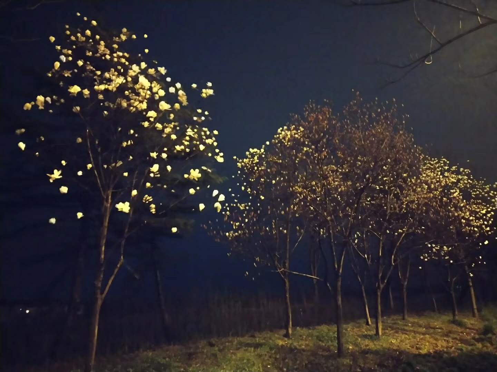
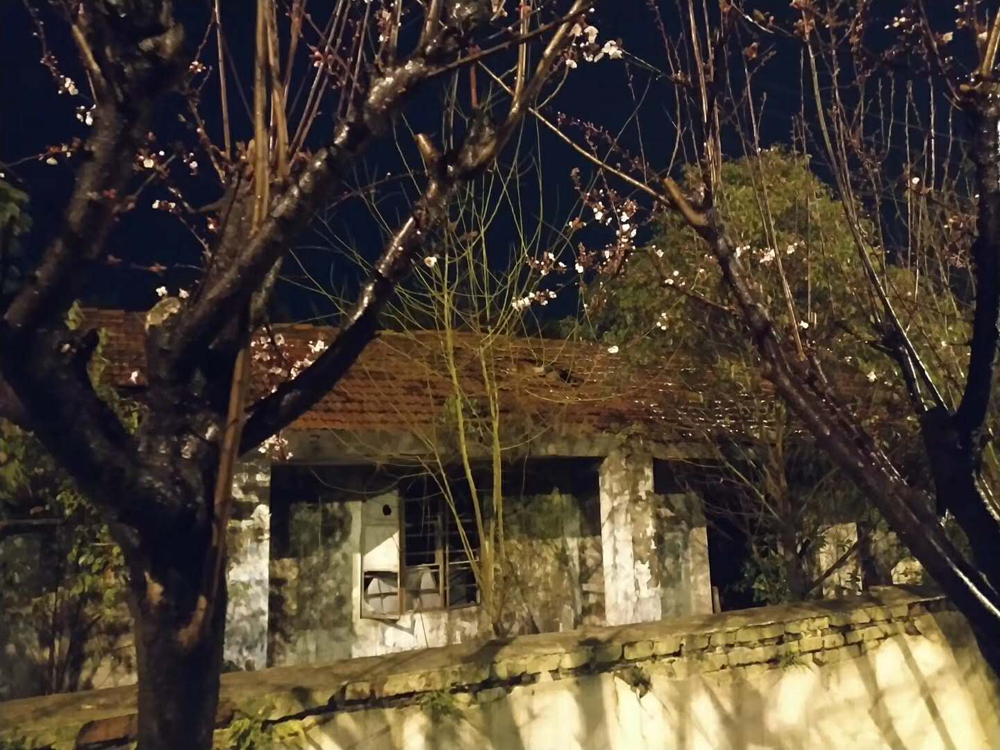
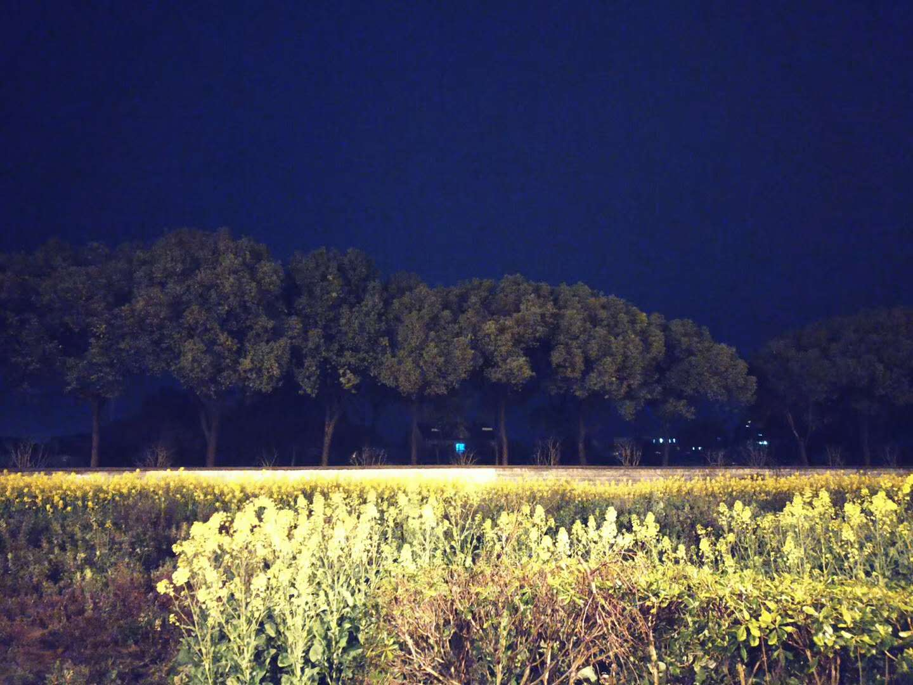
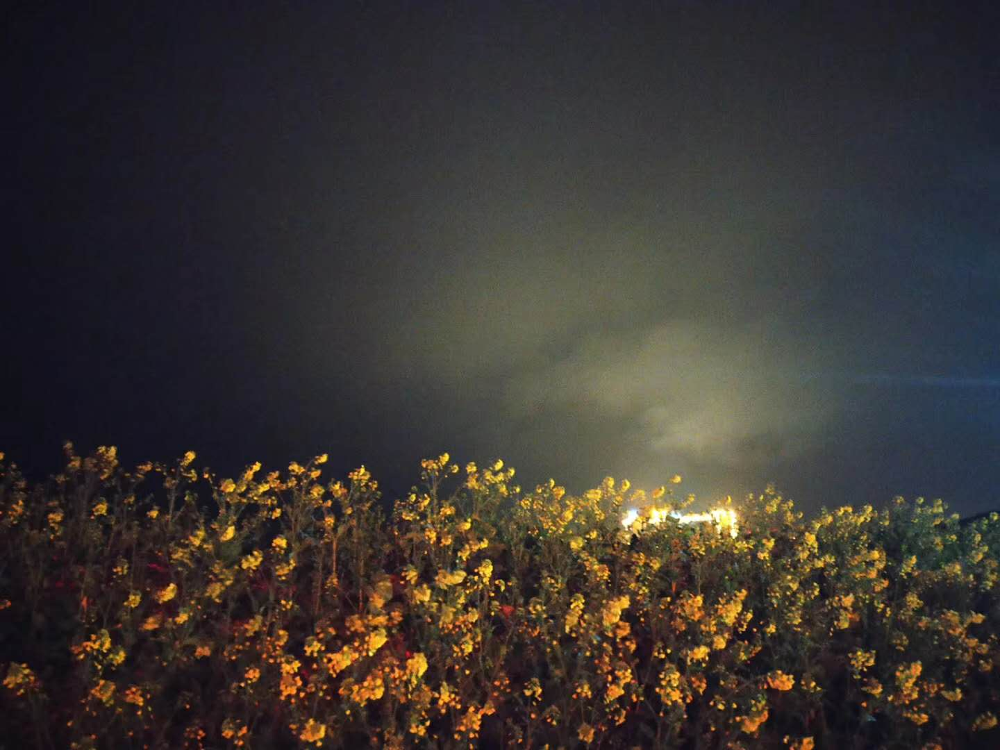
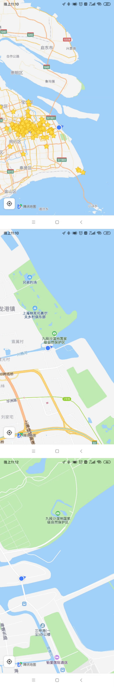
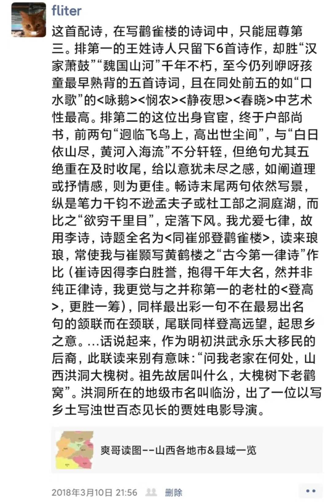

 

这日，令狐冲参透『易筋锻骨篇』诀窍，喜不自胜，听着曲儿，孤身一人径直东行。

 

其时正是初春，夜间冷雨来袭，更是寒气料峭。此时令狐冲内力虽不臻化境，却也已有些修为。只一炷香功夫，听着天竺梵文(经济学人)，沿川杨河，不觉已奔出20余里，来到入海口。

那数月正闹疫病，商户闭市，居民早歇，住宅区每个门口，村镇每条通路，皆有人把守昼夜不停。即便身后繁喧的过往远东第一大城，也不及同期热闹，更况是这郊野海边，原生态的渔村。

就这般至一孤岛，川杨河不复涛涛，平静归流入海。起眼处，一望无垠的太平洋，只有零星几点微弱灯火，从漆黑一片的浩瀚中穿透而来——那许是邮轮，也或是出海的渔家。而再行几步，是官兵屯驻之所，却也不见守备，与周遭一般侘寂。

华亭一马平川，无有名山高岳，不及其家齐鲁。令狐冲独立洲头，想往来诸事，似陈公子昂登幽州台，感岁月无痕，若湘潭毛公临橘子洲。杜工部于岱岳之巅，俯瞰众生，生孔夫子众山皆小，大致若此。王之涣于鹳雀楼，见九曲黄河东去，魏国故往山河，登楼穷目，亦非能外。

雨点密集，战场鼓点一般。生完浩叹，令狐冲摸摸湿透的衣衫，开始琢磨，这可咋回去

 

[天地都在我心中](http://www.kugou.com/song/1vo9d15.html)
