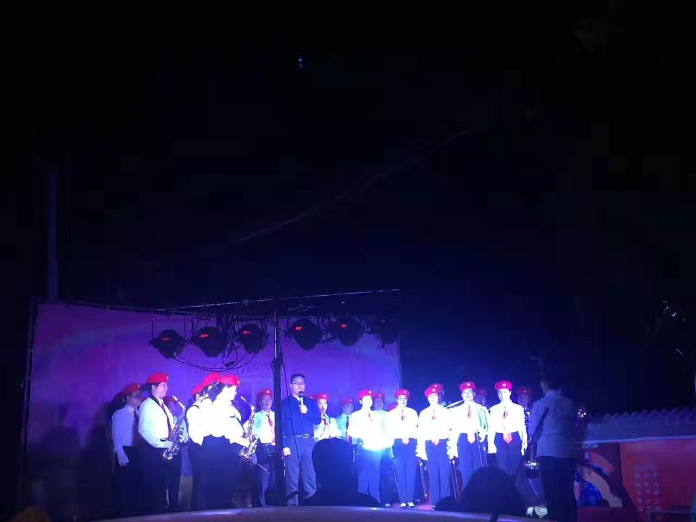
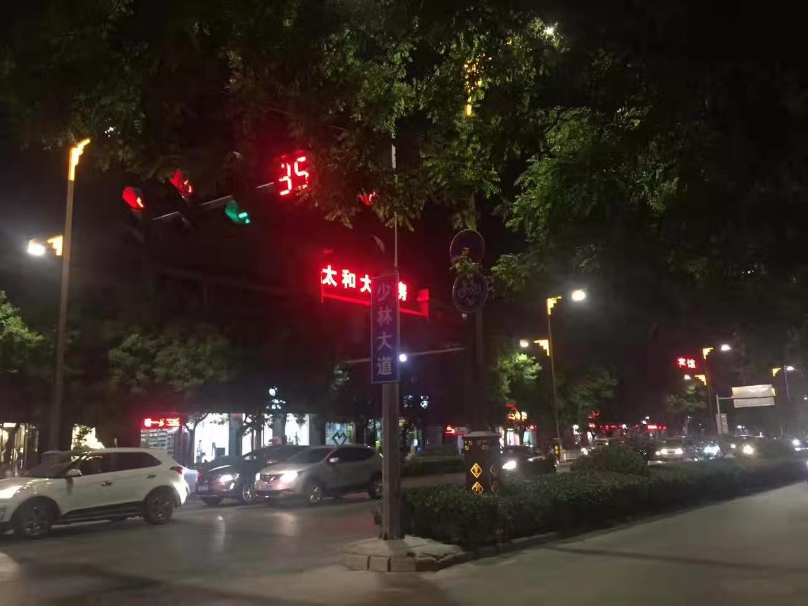
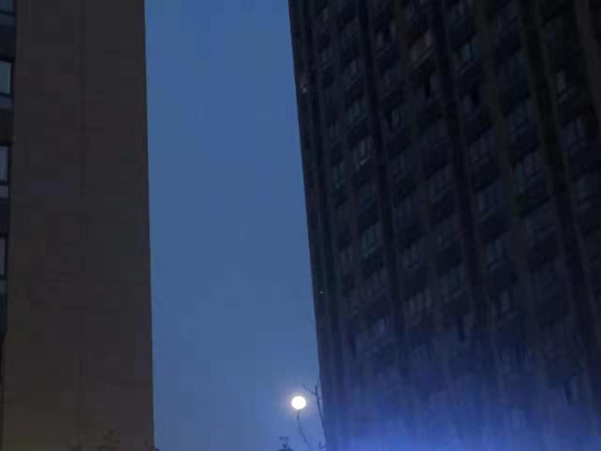
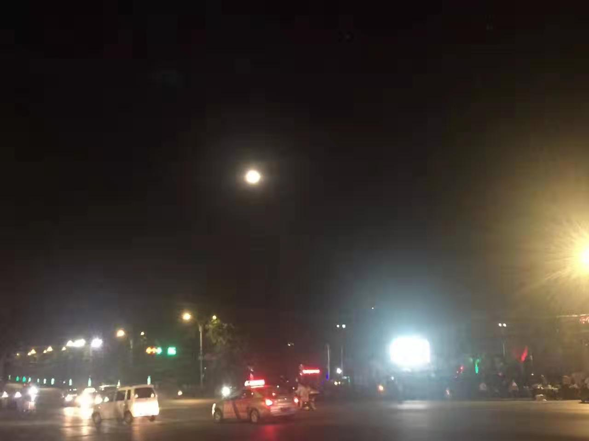

 

却说令狐冲下了太室山，已近戌时，这时正值入夏，天虽未黑，一日在山间跋涉不进水米，却也饥肠辘辘，腹中馋虫咕咕大叫。昨日曾听客栈老板，本地有一夜市，名鸡鸣街，晚间热闹不一般。

令狐冲回房，草草冲洗，湿身穿衣，敛集剩下的几块散碎银两，带上西洋美利坚乔铁匠制佩剑，走出客栈。一路执剑探看，走了约摸4里路，见一路口人头攒动，一条东西街道，延绵数里，皆是商贩，心下一凛，想来这必是鸡鸣街了。

登封城虽非大邑，可令狐冲自小长于山间，绝少进城。面前灯火通明竟同白昼，花红酒绿好不热闹，山野盲流子几时曾见过这些，不觉好奇之兴奋，心下感慨：今日亲临，这夜市之誉，确是不虚了。

在一小摊桌前坐定，招呼掌柜来一上等下酒菜，见同桌人有饮崂山琥珀酒者，也不禁绝口中干渴无味，食指大动，惜甚无酒。遂起身去近旁酒肆，沽来一大罐农夫御制清酒。这酒产自南宋皇城临安府，不过这时又已改叫做杭州。乃用淳安千岛湖中湖水古法炮制而成，畅销天下。令狐冲曾去杭州，那日同魔教左使向问天，营救任教主，正是在孤山梅庄西湖之下。只这淳安离杭州城有250里，处于山中，道路坎坷不易通行。

羹尽酒残，令狐冲抹抹嘴，放上两钱银子。踉踉跄跄走出，没走几步见一煎饼果子铺，量大份足，只要5个铜板。又见一人在卖樱桃，想曾听人说“樱桃好吃树难栽”，在华山未能得偿此果，不知味道若何。

行至路边，听得重金属丝竹之声，有人和唱，字字铿锵，响亮至极，几曲下来竟毫不泄力。令狐冲大骇：此人内力如此之高世所罕见，想这登封一少林寺一嵩山，却是武学圣地。蹑手寻声看去，发声物却不是人，而是一形似牵牛的铁器。心中疑惑这是何机巧？感叹这世间能工巧匠实在之多，山东公输班，西洋特斯拉，皆是能化腐朽为神奇之神工。

细细听辩所发之声乐，令狐冲虽未上几年学，却也识得几字背得几诗，听这词句，却不是诗经楚辞，也非唐诗宋词，只听得“你是我的小呀小苹果”莫名之语，又闻听“月亮之上，我在仰望”，也不禁举头望月。

这日正值四月十六，婵娟正浑圆低垂天边。令狐冲想起昨日还在洛阳，今日就已在嵩山脚下。见两楼之间明月，想起前人孟郊诗句，“天津桥下冰初结，洛阳陌上人行绝。榆柳萧疏楼阁闲，月明直见嵩山雪”，这孟郊乃是唐朝一位大大的文豪，绰号“诗囚”，和爱推敲的贾岛齐名，江湖人称“郊寒岛瘦”。

孟文豪“一日看尽长安花”原是令狐冲未失学时夙愿，却永远成梦，现下行走江湖辗转各地，早已将书本所学抛之脑后。倒是“临行密密缝，意恐迟迟归”更为贴切。想来已近西洋椿萱节，需为高堂备一份礼托驿馆寄回。人在他乡，望着月光，不禁多了些心涉遐想。又想起明日需去少室山拜会少林，便未再多虑。

其时明月在天，清风拂叶，街上人渐散去，车马也少。令狐冲不时喝着农夫酒，一步步去回客房。

 

