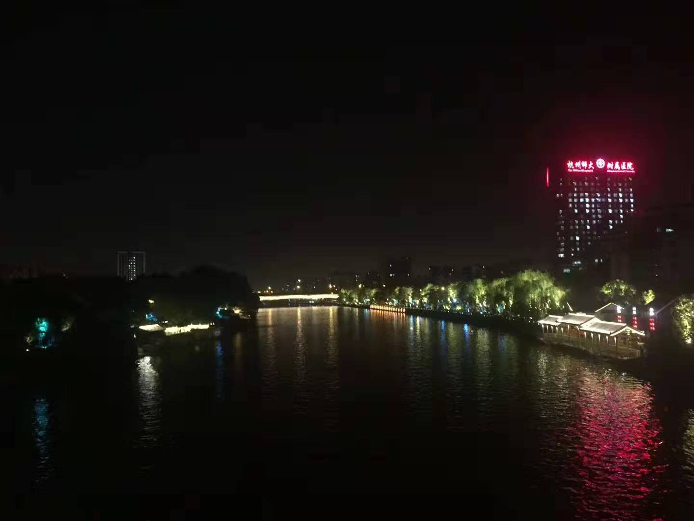
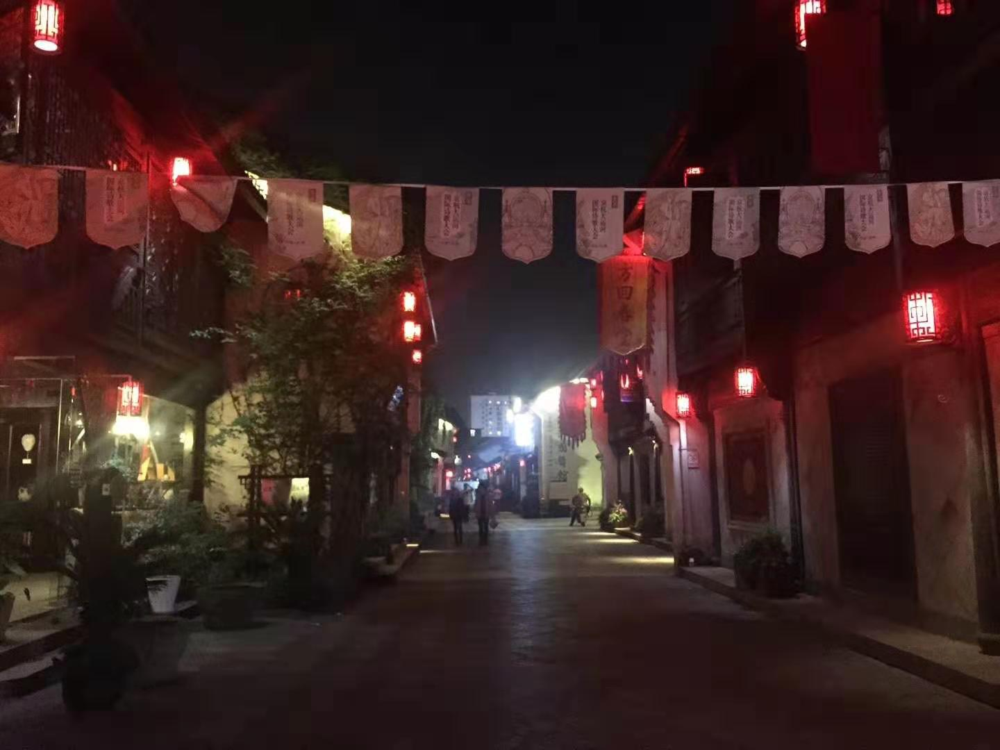
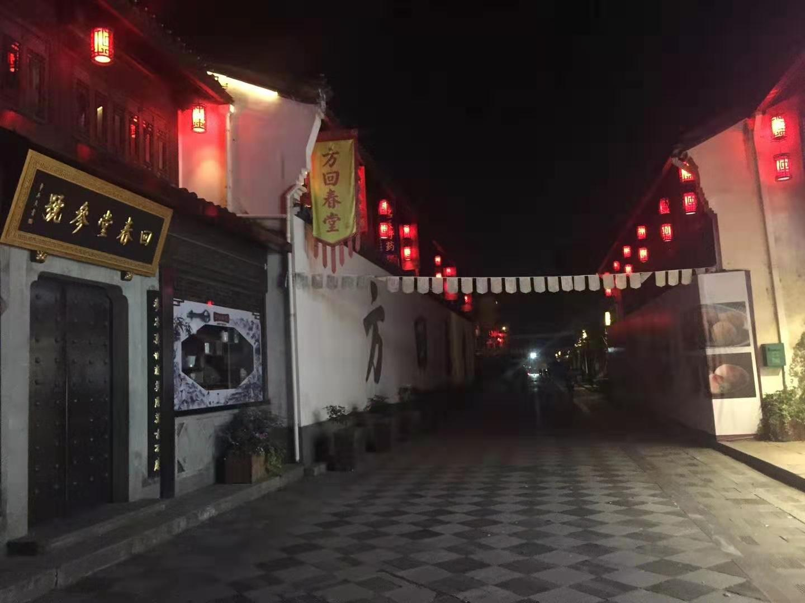

 

终至临安府，这日西湖游荡，却觉甚妙，不负诗魔坡仙之赞誉。段誉之北冥神功，后与星宿派化功大法糅合，成亦正亦邪之吸星大法。这日游梅庄，却不知几百年后的明代，此地会与其庶传后人有若干关联。

临安府市列珠玑，户盈罗绮，开销又自不小。段誉别无他技，这日临暮，忽生一计。于拱宸桥尖，自觉身无长物，哀感不尽，滚滚并来，便奏起在无锡三清殿老道所授乐曲，其声呜呜，如泣如诉，听者为之动声，观者为之泪目。方寸便得数铢。此后多年，三清殿有一私生小道，双目失明，命途多舛，其整合旧传音律，加之自己身世不幸，常对二泉以自诉。此后竟成名曲，与嵇康之<广陵散>，王摩诘之<渭城曲>不分轩轾。

夜深人散，段誉收起破碗，掂量所得，颇重。便至一旁牛家村“曲三酒馆”买醉。这武林城名之不虚，尚武者甚众。这小小酒肆，竟也列陈十八般兵刃。

段誉自是不知，这曲三酒馆掌柜有一玄孙，天赋异禀，时海外桃花岛声名鹊起，不辞烟波至此学艺，却不期后来同门事起，一师兄师姐私好，盗师秘籍，逃窜漠北。

其师怪僻，一怒之下，废其身而逐师门。同怜有师兄豪门陆氏，归太湖归云庄；有师弟贫病冯氏，回苏北乡间铸铁为业。曲氏便回牛家村，承继了这间酒馆。

近乎同期，牛家村有郭杨二兄弟，梁山好汉/将门之后。乐善好施，打抱不平。二人夫人皆欲产，便指腹曰“若为璋瓦便结连理，若同是男儿便结兄弟金兰”。时靖康之变已久矣，然金人虎视，朝堂无力，南人尽有去国之悲。有一道人路过，定二婴名为“靖康”。却若白云苍狗，此后渡尽劫波，郭姓男童远走大漠，而后与曲氏师傅之女相识于张家口，却不是三言两语所能道清。

曲氏无一日不祈师傅原谅，重回师门，却不思其无过错，却断双腿。知其师喜爱丹青，竟至南宋宫中偷盗。开掘密室，藏匿珍宝。河边常走，终一日为宫中职守发觉，追至此，同西归于密室。此间极有曲折，郭黄二人疗伤，后战死襄阳，草蛇灰线，伏埋千里。

酒酣饭足，忽得传信。这蛮荒之地的福建有一古刹名南少林，常年无名。后忽得一绝学，名"red sun cookbook"，据传与数百年后闻名江湖的<九阴真经>一样，为宫中高人所著。却说此时江湖，古刹因武学最盛者，为中州少林寺之<易筋经>，与大理天龙寺之<六脉神剑>。

段誉自是好奇，这南少林得之瑰宝亦或鸡毛。便决定继续南下。后人皆知，这秘籍确非同小可，后来的吸星大法亦是不敌。而纵再有奇遇，得此至宝，以段氏“五罗轻烟掌”之秉性，也自是绝计不会修炼。

其实段誉南去，还有一个原因。便是连日行走，鞋已尽破。听闻南少林寺所在的莆田，鞋做的不错，便要去试试

