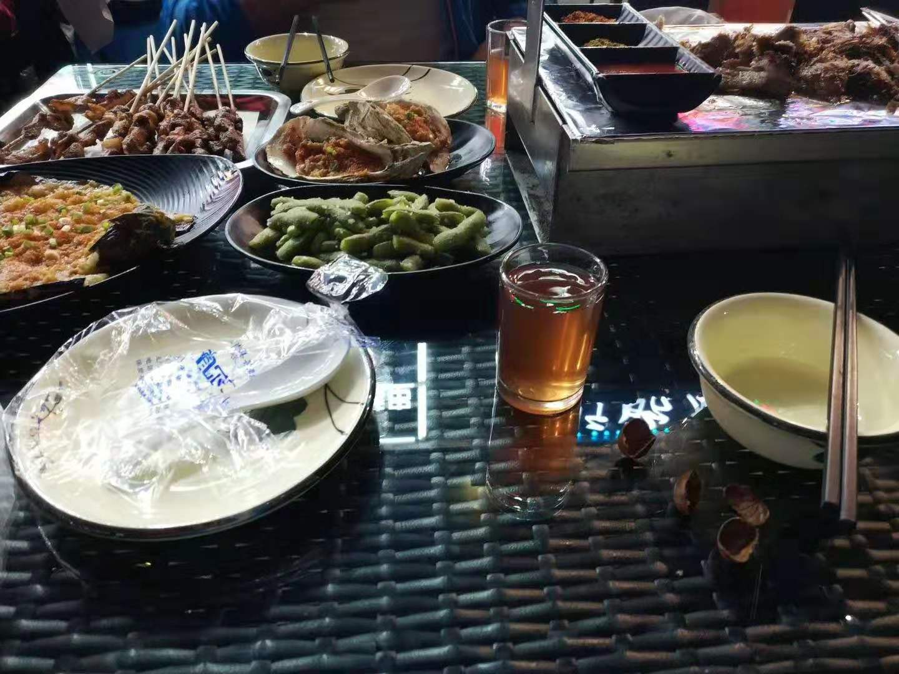
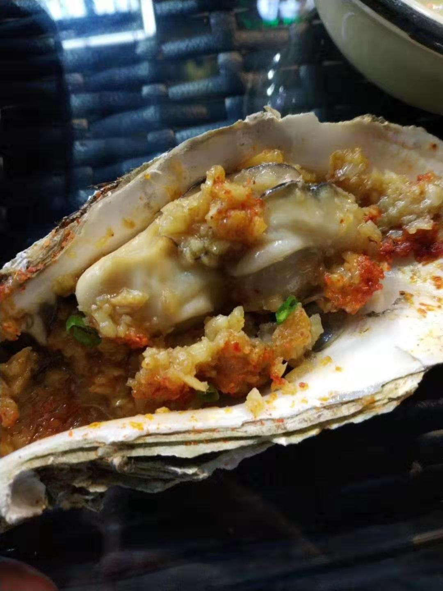
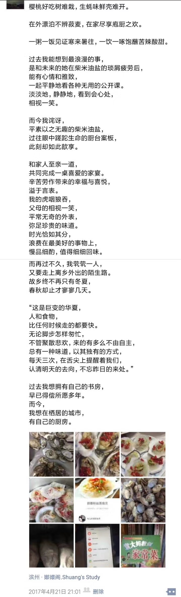
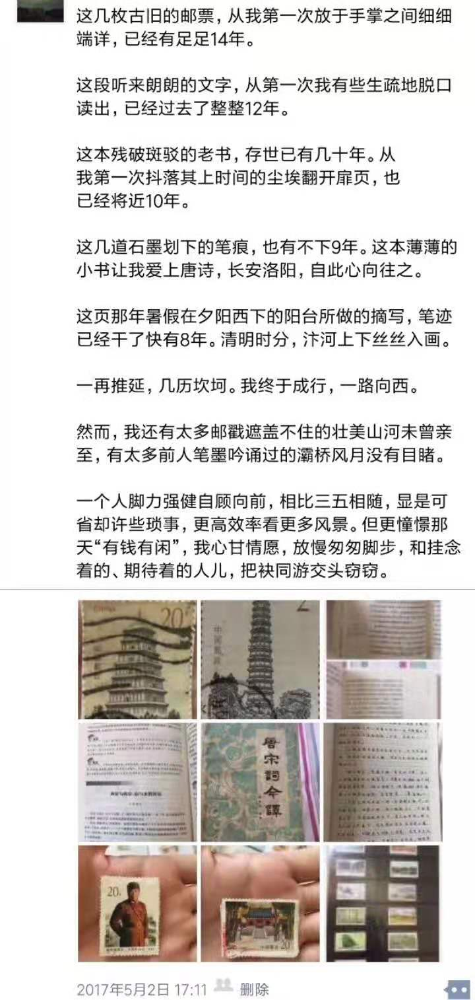

 

令狐冲自下山来，中途又经几番舟车劳苦，掸去素衣风尘，终在罗刹江滨一夜食店坐定，把酒言肉，大快朵颐。

同行旧友点菜完毕，店家烤炙，不多时便上来。羊腿甚佳，一日山中攀行不进水米，得此天物正欲鼓起腮帮子。却不知有两枚生蚝，见之一时凝噎。

令狐冲酷喜海中诸物，见生蚝必想起法兰西人莫泊桑之<我的叔叔于勒>，食前必深呼吸曰“此物有大海之味，黄钟大吕排山倒地，公孙大娘舞剑也”，食时则闭眼，歆享如怡曰“有初恋之感，幸福得睁不开眼”，食罢则鼓噪唇舌曰“此余味无穷也，如闻韩娥奏丝竹管弦”。

想必一年多来，是吃进过好些次。乍见之时，却多已不记。只遥遥想到，一年多前，从沪离职北上。时做一口腔手术，几日即可痊愈，父母却餐餐费神，一起张罗饭菜。老夫老妻于海鲜并不热衷，却为我之乐而乐。停留两周，便一路向西，游离古都，攀登高岳。在车站，想及魔都羁旅二载，终不得留，行将随潮去赴杭州，压力或小，赶紧取得户口购置住房。有朝得闲得钱，趁二人身体尚好，带其一同“去看看”。未及再多想，车便隆隆发动，带 其告别了家乡。…

 时日如梭，两次面对生蚝，一年又半载。这一年半来，发生好些，让其始料不及感慨连连。…令狐冲思及此，却似有旧伤，一口老血上涌，迸裂喷射不能自己。想当年浔阳江头江州司马，虽一人孤处满腹悯然，却也有他乡沦落人更有知音“满座重闻皆掩泣”，而我，而我，这熙熙往往满满一条街人，却无人可与言及一二。

 

 

匆匆心不在焉吃罢，令狐冲饮完杯中浊酒，便起身又走，不多时便消失在茫茫夜色与茫茫人海中。

