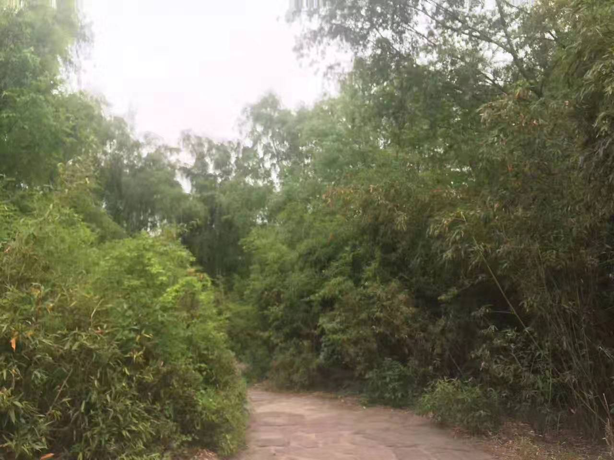
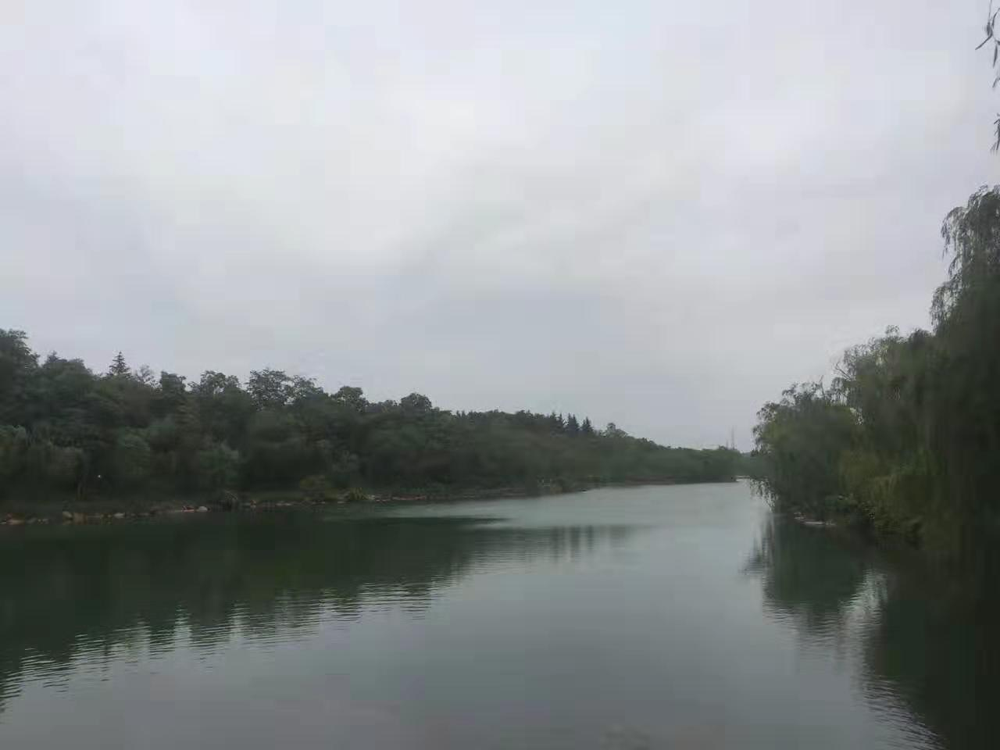
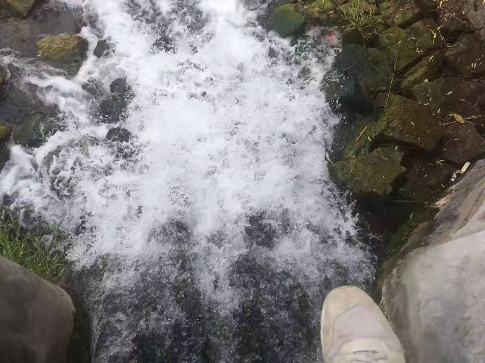
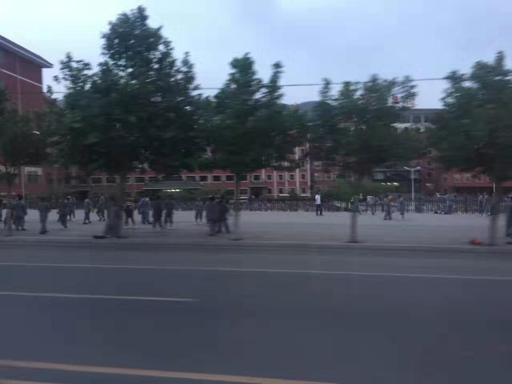
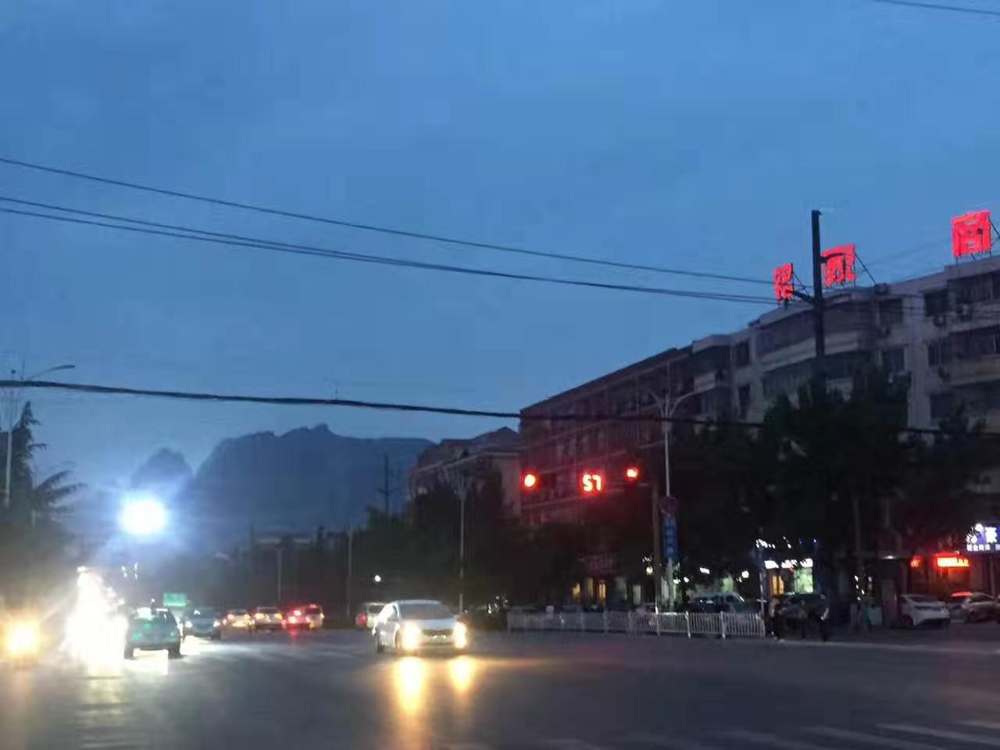
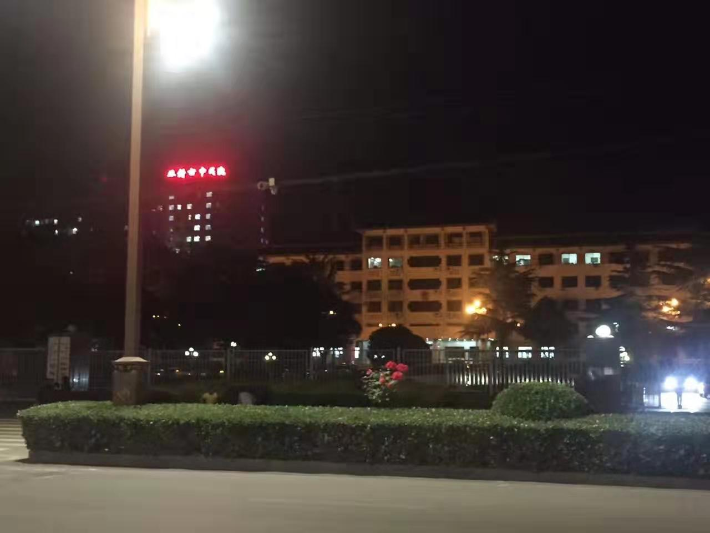
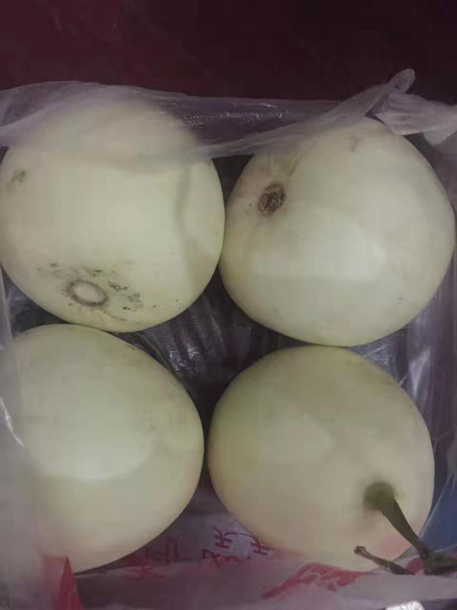
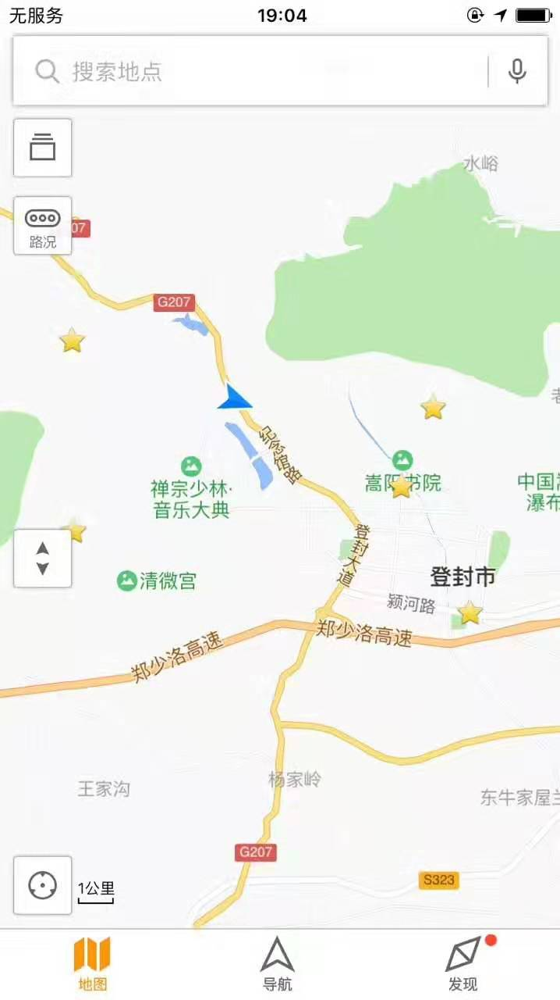

 

岳先生要在四月十六武林大会这天，赴嵩山封禅台找姓左的，用紫霞神功和新练成的林家剑谱，怼嵩山掌门的寒冰真气和大嵩阳掌。

华山派弟子令狐冲，身负上乘剑术，受冤除籍，下华山已有三日。正于洛阳东郊竹林学琴，或于黄河旧孟津渡口访友。听闻此消息，不得已中断洛城温存，赶赴登封。

途径洛邑以东的偃师，在驿路旁远远瞥见民舍当中的“玄奘寺”，不禁想起先帝朝一位吴姓秀才所著<西游记>，想那齐天大圣，三打白骨真假美猴，被唐僧冤枉赶走，也还是捐弃前嫌继续西行，不禁加快步伐向东而去。这书在当时属于禁书，莫说令狐冲没上过几年学，就是饱学鸿儒也未尝可知。令狐冲能想及此间典故原委，殊是难得。

不一日，已抵登封。这登封城原亦属洛阳，因几十年前朝廷修筑馆驿官道，使以东的小邑郑姆斯特丹渐聚集人脉，竟成河南府首屈一指的大城，后登封亦为其所辖。

令狐冲在马上打量两侧，灰衣僧众甚多三五里可见，想少林寺为天下第一名门正派，天下武功尽出少林，千年长盛不衰，又有扫地僧及觉远大师这样不露头角的人物，当真是卧虎藏龙人才辈出。一山不容二虎，而这左掌门，竟能在这小小登封城少林寺之上，拉扯起一派大旗，想来也是非同小可厉害人物。明日必有一场好戏。

天色渐晚，令狐冲想，此时登山太过唐突，不妨找店住下，明日一早再做商议。遂找店住下，饱食一顿，心想，我绝不可做事不管空手而上，于是又去杂货店购置小板凳，葵花籽，白皮瓜…
 

