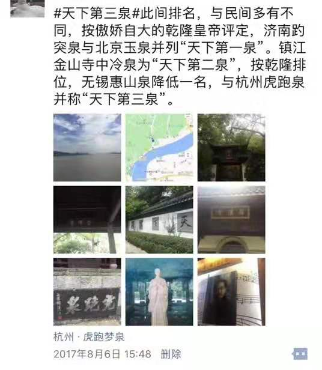
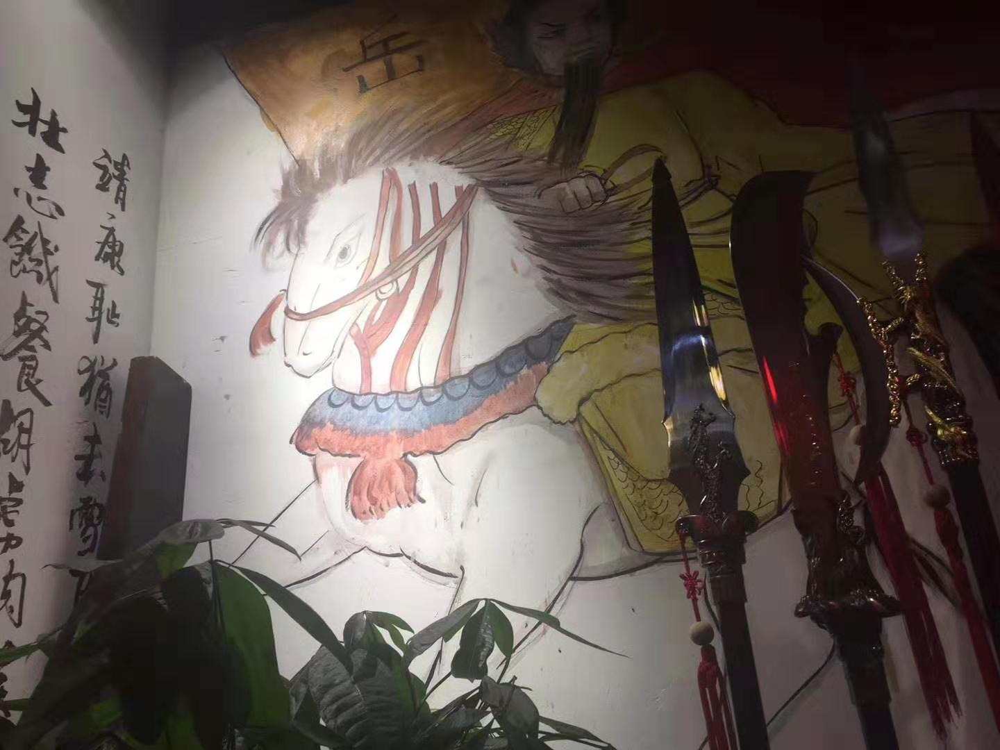
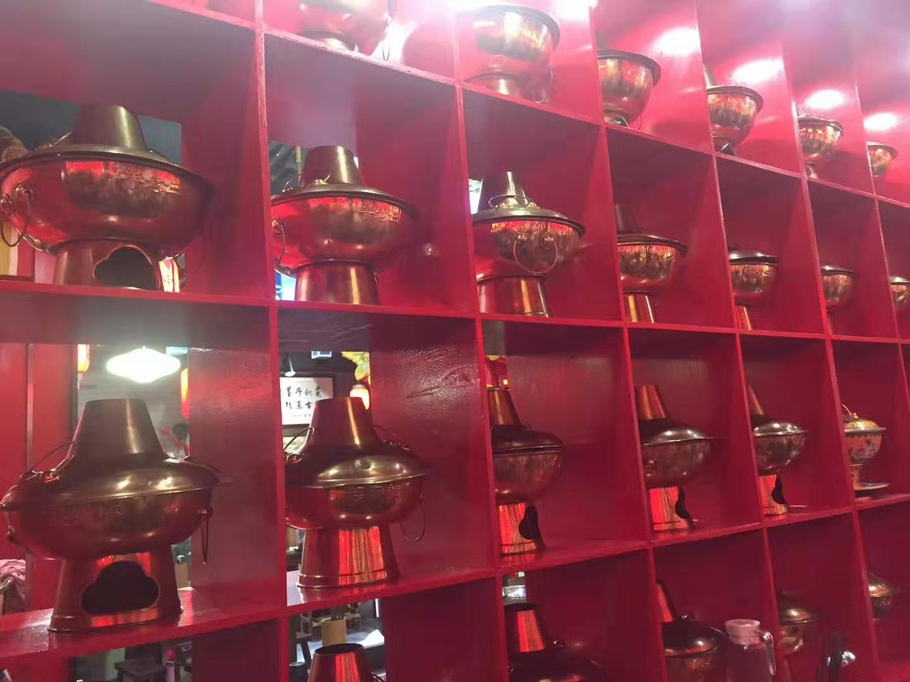
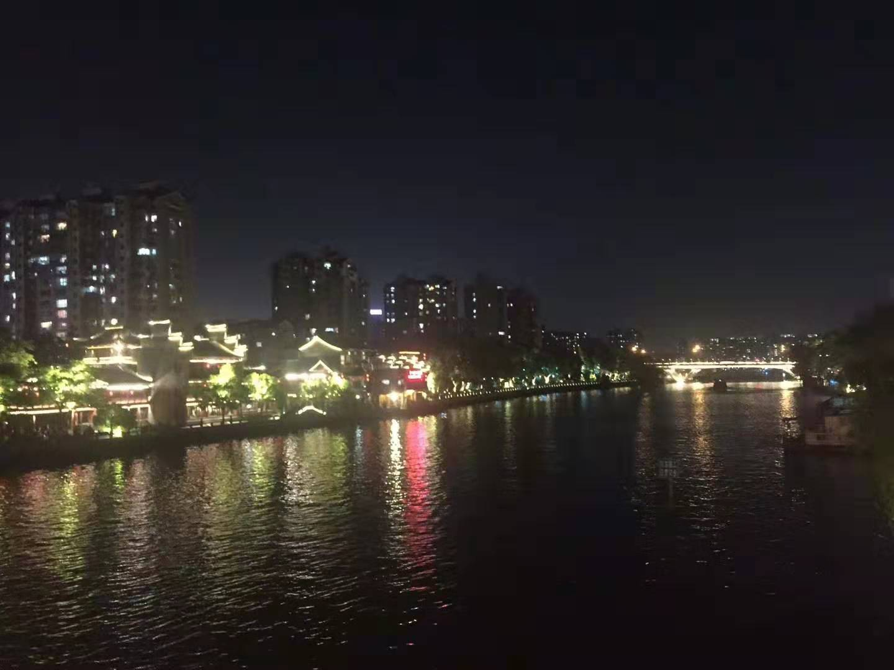

 

却说段誉自无锡杏子林一别乔峰，便沿驿道东进，到了姑苏。自春秋以来，此间便为繁盛之地，待至隋炀开凿运河，千里通波，便更是八街九陌琼楼玉宇。馆娃宫依存，虎丘塔仍在，燕子坞与曼陀山庄，却似蓬莱，青鸟无着。段誉羁旅在外，又兼此，心中愁绪尽起，这日便至寒山寺寻渡。

这寺初建于自上而下全民兴佛的南朝梁年间，初名“妙利普明塔院”。太宗贞观年间，由名僧寒山在此修缮扩建，更名“寒山寺”。天宝年间，襄阳人张继科考不第，宿经姑苏，霜天寒夜月落乌啼，孤舟客子见江枫渔火，夙夜难眠，写下诗作流传不朽。寺院住持一番鸡汤劝慰，知是大理世子，谙熟翰墨，便请题诗。段誉提笔欲挥，忽思起前唐武宗，虽位在灭佛的“三武一宗”，却对此诗甚喜，亲为寺题碑并留谶语：复题碑者不得善终。段誉早年偏居大理，曾听天竺人说：西有古国名埃及，其头领曰法老，有一年轻早夭者图坦卡蒙，为防陵寝被盗，尝留诅咒，百试皆应。思及此，段誉便绝笔婉拒。事后来看，却是躲过一劫，及至明清，皆有名流题<枫桥夜泊>碑，倏而皆殒。至20世纪30年代，倭国袭扰，金瓯半丧。扶桑人曾惦此碑，时有爱国者，损身以应，令倭人胆裂而色变。[点此查看相关](http://news.ifeng.com/history/1/midang/200903/0303_2664_1041190.shtml)

自辞姑苏，顺吴淞江而下，至华亭县。这华庭初是浙东会稽郡某县东面一亭（乡），后吴将陆逊于夷陵大败蜀先主刘备，得赐王侯于此。至玄宗天宝年间，始置县制。全域平坦一览无余，只西南有山亦有水，为浙江天目之余脉。便得之“华亭”。及至元代，方升为府，改名松江。

段誉由姑苏大邑乍至小地，青旗沽酒，多有不适。这日在井边饮水，忽听浣纱女“重湖叠巘清嘉。有三秋桂子，十里荷花”，心思运河两岸多处繁华，尤以武林城为最。又听人言，“来了苏杭，忘了爹娘”，姑苏自是不虚行，却不曾至余杭，图虚度至弱冠，岂不可惜，遂折道西南。时有人柳氏名“三变”，科场不遇，混迹烟花柳地，造词谱乐，虽靠歌妓接济度日，然词多有普及，甚或流传千年。

华亭与武林城相隔近300里，段誉连日舟车，颇觉劳顿。这日至嘉兴，城中有湖名“南湖”，湖边有酒楼，便停顿数日稍作休整。及至临去，却才觉在无锡与乔峰斗酒十千，自已银两无多，又几日挥霍，临此才知捉襟见肘。酒肆掌柜见段誉有魏晋风度，拓拓之风，便不为难，言道“本楼新开，暂名"未名"，今请公子，抛砖引玉，以启后来人潘江陆海”。段誉极目，见那湖上烟雨濛朦，虽是晴天，却如雨日。便书名为“烟雨楼”。此楼兴隆百年，及至南宋末年，一班武林人士于此斗殴，桌凳楼体，毁损严重。

脱身嘉兴方一日，便到海宁。陈氏与查氏为此地望族。近千年后，此地有查姓财主，喜得麟儿，定名“良镛”。此公好足球，好诗书，却两次为学堂除籍。后至上海又远走香江。然多事之秋其父被枪决，愤懑之中百感并集。曾将江湖旧事收纳集结，引为佳话。

