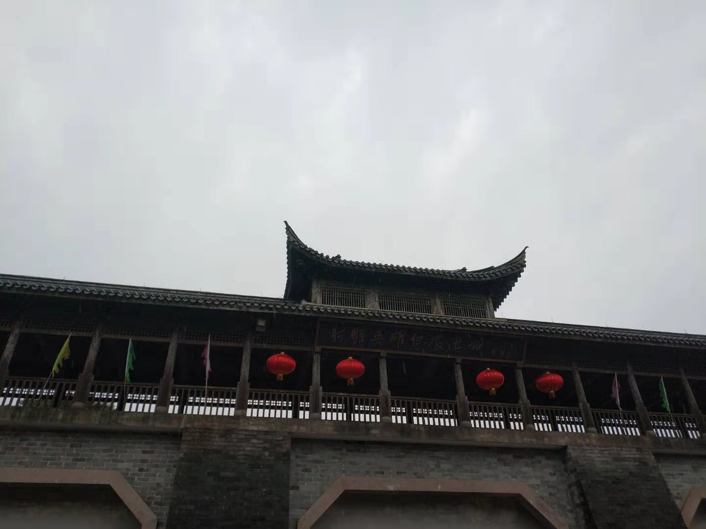

 

14年前，在黄海边一个车牌同为"L"的海港小城，在一处同样题写"桃花岛"并落款先生大名的海岛外，彼时并不会游泳的我在浅海滨搏击风浪，像一个真正的弄潮儿有模有样。

受四遭一干金粉的耳濡目染，受那位中学副教授忘年交的"怂恿挑唆"，不知不觉，我也"误入此坑"不能自拔，如发现一片新大陆，像饥肠辘辘旅人突见饕餮。

同样"深陷于此"的，还有那个端坐"光明顶"自号"风清扬"的前英语老师，以及看到案头<笑傲江湖>，用fox命名自己邮箱作品的"微信之父"，还有笑看诸君"naive"天文地理无所不通的年迈长者。

唐宋以来巨族，江南有数人家。先生学识渊博浩瀚，先生文字汪洋恣肆。先生用笔和纸，构筑了许多中国人的精神价值观，家国，狭义，儒道，恩怨，人心…

先生家国情怀浓烈，虽迫于时局远走香江，却无时无刻不关心大陆，最是推崇诸葛和老杜。某年剧变，先生端坐电视机旁，见邓姓"老友"出面，才确信其未被软禁，悬心落下。

先生思想新潮进步，一个异族草莽，能成笔下最悲壮英雄豪杰；一些受桎梏压迫的旧时代女性，有独立主见更敢于发出自己声响。

先生来世一场，儿女情长。于是有了"陈家洛"，有了封禅台的剑舞"冲灵"，有了"世间多少痴情女，伤尽男儿不自知"，有了赵敏"偏要勉强"，有了"世间少年男子…不禁为之哑然失笑"。更看到删掉的"当时若爱韩公子"，以及新加的那句让人无尽唏嘘的"我当时还不明白"。

我尝追寻先生步履，不辞千里，在[华山之巅](https://dashen.tech/2017/05/30/%E5%8D%8E%E5%B1%B1%E5%88%AB%E4%BC%A0/)，在[洛城东郊](https://dashen.tech/2017/05/10/%E6%B4%9B%E9%98%B3%E5%9F%8E%E4%B8%AD-%E7%BB%BF%E7%AB%B9%E5%B7%B7/)，在[少室山下](https://dashen.tech/2017/05/11/%E5%B0%91%E5%AE%A4%E5%B1%B1%E4%B8%8B-%E9%B8%A1%E9%B8%A3%E8%A1%97/)，在[西湖梅庄](https://dashen.tech/2018/10/06/%E6%AD%A6%E6%9E%97%E5%9F%8E%E5%A4%96-%E9%85%92%E8%8C%B6%E8%82%86/) …终南山古墓长闭，万花坳花落无声，绝情谷空山寂寂，风陵渡凝月冥冥。音讯阻隔终不能得偿所愿。

海岛桃花已盛开，昔人却驾黄鹤去。"大闹一场悄然离去"，在此刻这个云集70亿众生的星球，无论达官显贵，或是天王巨星，究竟能有几个，可以穿透历史云层到达彼岸？又有几个能够把自己名字，镌刻人类文明发展长卷？路人皆可随口诵几句"大江东去"，而几人得知那个让作者死去活来 一生颠沛的帝王年号追谥？

我之宏愿，也能借先生如椽巨笔，写下三五遗篇。不消畅销人尽皆知，更不敢奢求成为景点 令后人跨海而来。 它能在我身后百年，在一个夏雨午后，能让一个优秀少年或青年在书桌前驻足凝思，隔纸页与我凝空对视，则实在已经心满意足。

先生铁粉 梁城莫颟 2019.3.6